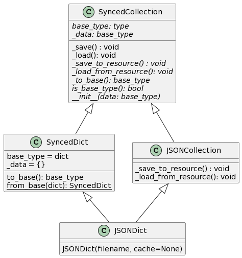

.. _library_design:

.. currentmodule:: synced_collections

==============
Library Design
==============

**synced_collections** is designed around a clear separation of concerns between the two primary aspects of such collections: 1) handling synchronization with a particular backend, and 2) matching the API of a particular type of Python collection.
For the first, a given collection must define how data should be stored to or loaded from data stored in the backend.
The second typically requires matching the expected API of one of the ABCs defined by `the Python standard library <https://docs.python.org/3/library/collections.abc.html>`__.
Additionally, it requires a clear approach to handle the recursive traversal of a nested data structure to ensure that all nested collections are also of the appropriate type to ensure proper synchronization.

These central concepts are expressed via the abstract API defined by the :class:`SyncedCollection` class.
Subclasses of this class may be divided into two subsets reflecting the above separation of concerns: 1) backend classes and 2) data type classes.
A given backend class implements only the functionality that defines backend synchronization, while a data type class implements only the API of a given data type, so both remain abstract.
A concrete :class:`SyncedCollection` subclass should be defined by combining a data type class with a backend class via inheritance.
This idea is best illustrated using an example, such as the one below:

..
   The above diagram was generated using https://plantuml.com/ and the following spec

   class SyncedCollection {
       {abstract} base_type: type
       {abstract} _data: base_type
       _save() : void
       _load(): void
       {abstract} _save_to_resource() : void
       {abstract} _load_from_resource(): void
       {abstract} _to_base(): base_type
       {abstract} is_base_type(): bool
       {abstract} __init__(data: base_type)
   }

   class SyncedDict {
       base_type = dict
       _data = {}
       to_base(): base_type
       {static} from_base(dict): SyncedDict
   }

   class JSONCollection {
       _save_to_resource() : void
       _load_from_resource(): void
   }

   class JSONDict {
       JSONDict(filename, cache=None)
   }

   SyncedCollection <|-- SyncedDict

   SyncedCollection <|-- JSONCollection

   JSONCollection <|-- JSONDict
   SyncedDict <|-- JSONDict

:class:`SyncedCollection` defines a few critical abstract methods:

    - ``_load_from_resource``: Loads data from the backend. This method must be defined by backend classes.
    - ``_save_to_resource``: Save data to the backend. This method must be defined by backend classes.
    - ``_to_base``: Convert a :class:`SyncedCollection` to its base type (e.g. a Python dict). This must be defined by data type classes.
    - ``__init__``: The constructor, which must support converting from the base type. This must be defined by data type classes.

In addition, the class defines the following two concrete methods:

    - ``_load``: Loads data from the backend, accounting for nesting (i.e. ensuring that only the top-level collection is responsible for loading) before calling ``_load_from_resource``. This method should be called before any read (or read/write) operation on a collection.
    - ``_save``: Stores data to the backend, accounting for nesting (i.e. ensuring that only the top-level collection is responsible for storing) before calling ``_store_to_resource``. This method should be called after any write operation on a collection.

In the example above, the JSON reading and writing are managed by the ``JSONCollection``, which implements ``_load_from_resource`` and ``_save_to_resource``,  while the dictionary interface and recursive updating are handled by ``SyncedDict``.
In addition to the core ``SyncedCollection`` APIs shown above, ``SyncedDict`` implements the API of a `MutableMapping <https://docs.python.org/3/library/collections.abc.html#collections.abc.MutableMapping>`__ (all of which will leverage ``_save_to_resource`` and ``_load_from_resource`` under the hood).
The benefit of this architecture is that once a particular data type is implemented, it may be reused for an arbitrary backend, and vice versa.

Validation
==========

Not every backend supports every type of data.
For instance, some backends may allow integral keys while others require string keys, or some backends may require homogeneous entires while others permit heterogeneous ones.
Validators provide a standardized mechanism for this.
A validator is a callable that parses any data added to a :class:`SyncedCollection` and raises an `Exception` if any invalid data is provided.
Validators cannot modify the data and should have no side effects.

There are two attributes that subclasses of :class:`SyncedCollection` can define to control the validators used:

    - ``_validators``: A list of callables that will be inherited by all subclasses.
    - ``_all_validators``: A list of callables that will be used to validate the current class only and will not be inherited.

The reason to support both of these is that in some instances a class may not wish to inherit the validation strategy of its parents, but it also may not want to modify the set of validators inherited by its children.
Overriding ``_all_validators`` provides a way for a class to control only itself without modifying the rest of the hierarchy.
Attempting to use a more hierarchical approach where ``_all_validators`` was also inherited but given higher precedence than ``_validators`` would lead to much more complex resolution orders for validators.

When a  :class:`SyncedCollection` subclass is initialized (note that this is at *class* definition time, not when instances are created), its ``_register_validators`` method will be called.
If this class defines an ``_all_validators`` attribute, this set of validators will be used by all instances of this class.
Otherwise, ``_register_validators`` will traverse the MRO and collect the ``_validators`` attributes from all parents of a class, and store these in the ``_all_validators`` attribute for the class.

Buffering
=========

.. currentmodule:: synced_collections.buffers.buffered_collection

Since keeping the data backend synchronized can be expensive, in many cases it may be beneficial to buffer reads and writes.
The buffering protocol is defined by the :class:`BufferedCollection`.
This class defines the standard interface for classes that support buffering.
This interface consists of the following:

    - ``_load_from_buffer``: Loads data while in buffered mode and returns it in an object satisfying :meth:`synced_collections.SyncedCollection.is_base_type`. The default behavior is to simply call ``_load_from_resource``
    - ``_save_to_buffer``: Stores data while in buffered mode. The default behavior is to simply call ``._save_to_resource``.
    - ``buffered``: A context manager within which all reads and writes to a collection are buffered.
    - ``buffer_backend``: A class-level context manager that may be used to buffer reads and writes for all instances of that class.

This class then rewrites ``_load`` and ``_save`` to check the current buffered state (i.e. whether it is within a ``buffered`` context) and dispatch to the appropriate method for reading/writing to/from the resource or the buffer.

By default, :class:`BufferedCollection` performs no actual buffering.
Calls to ``_load_from_buffer`` and ``_save_to_buffer`` simply forward to ``_load_from_resource`` and ``_save_to_resource``.
However, subclasses may overload the ``_load_from_buffer`` and ``_save_to_buffer`` methods in order to change where data is written while in buffered mode.
Whenever a buffered context is exited, :class:`BufferedCollection` will flush its buffer.
The implementation of this flush is again left to subclasses to determine based on the buffering strategy they support.
